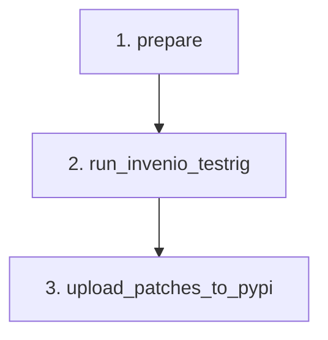

# invenio-integration-tests

This repository drives the automated release process for the [OARepo](https://github.com/oarepo/oarepo) package. It patches a set of upstream Invenio packages with OARepo-specific features, tests them via [invenio-testrig](https://github.com/oarepo/invenio-testrig), and publishes the results to the CESNET package registry.

## How it works

The release is triggered manually via the **Create oarepo release** GitHub Actions workflow. It runs in three sequential jobs:



### 1. `prepare`

- Reads `invenio-forks.yaml` and converts it into a machine-readable `integration-tests-config.json` (via `invenio-integration-tests setup`).
- Passes the list of patch specs to the next job.

### 2. `run_invenio_testrig`

Delegates to `oarepo/invenio-testrig`, which internally runs these jobs:

- **`prepare`** *(internal to testrig)* — Clones `oarepo/inveniordm-reference-repo`, resolves the dependency tree, cherry-picks all feature branches onto their resolved upstream versions, and produces a `workdir` artifact with the test matrix.
- **`test` / `test_slow`** — Run each patched package's own test suite in parallel (`stop-on-success` mode — skips the unpatched run if the patched tests pass).
- **`test_repository`** — Runs the reference repo's test suite with all patches applied. Note: `inveniordm-reference-repo` is a plain InvenioRDM application used for dependency pinning; it does **not** test the assembled `oarepo` package in an OARepo-specific context.
- **`test_e2e`** — Runs E2E smoketests against the patched reference repo using `oarepo/invenio-e2e`. Full UI tests are opt-in (`e2e-ui: true`). Only runs if the reference repo has E2E configured.

> **Note:** There is currently no integration test that installs the final `oarepo` package and validates it in a real OARepo-based application. The old `simple_repo` fixture that covered this was removed together with the previous test runner.

### 3. `upload_patches_to_pypi`

After the testrig succeeds, this job publishes everything:

| Step | CLI command | What it does |
|---|---|---|
| Mirror originals | `upload-original` | Copies all required PyPI packages to the CESNET GitLab registry so pip has a single source of truth |
| Patch entrypoints | `update-entrypoints` | Applies entrypoint additions/removals from `invenio-forks.yaml` to the patched package sources |
| Find distributions | `find-distributions` | Checks CESNET for already-uploaded patched builds (matched by patch hash); assigns version strings for new builds |
| Build | `build-distributions` | Builds sdist + wheel for packages not already on CESNET |
| Upload patches | `upload-distributions` | Pushes the built distributions to the CESNET GitLab PyPI registry |
| Update oarepo | `update-oarepo` | Checks out `oarepo/oarepo@rdm-<major>`, writes a fully pinned `pyproject.toml` (with PEP 508 markers from `dependency-markers`), bumps the version, commits and tags the result |

The patched package version format on CESNET is:
```
<base_version>+oarepo.<ordinal>.<patch_hash>
```

---

## Configuration: `invenio-forks.yaml`

This is the single source of truth for which packages are patched and how.

### Top-level keys

```yaml
invenio-version: 14.0.0b5.dev3   # informational target version

dependency-markers:               # PEP 508 markers applied to generated oarepo/pyproject.toml
  backports-zstd: "python_version < '3.14'"

packages:
  - name: <package-name>
    features: [...]
    entrypoints: [...]
    tests: [...]
```

### `features`

Each feature maps to a branch `oarepo-feature-<name>` in the fork repository. The commits between `base` and that branch are cherry-picked onto the resolved upstream version.

```yaml
features:
  - name: my-feature          # branch: oarepo-feature-my-feature
    base: v12.0.0             # cherry-pick source: commits between v12.0.0 and oarepo-feature-my-feature
    org: oarepo               # GitHub org of the fork (default: oarepo)
    invenio-version: ">=12.0.0,<13.0.0"  # optional: only apply for matching upstream versions
```

You can also reference a feature directly by commit hash instead of a branch name.

### `entrypoints`

Modify the entrypoints of a patched package. Supports `remove` (by group + name) and future `add` operations. The `_value` field is used to disambiguate when the same name appears in multiple groups.

```yaml
entrypoints:
  - remove:
      - group: invenio_base.blueprints
        name: my_blueprint
        _value: my_package.views:create_blueprint
```

### `dependency-markers`

Packages listed here get a PEP 508 environment marker appended when writing the pinned dependency list into `oarepo/pyproject.toml`. Use single quotes inside the marker value to avoid TOML escaping issues.

```yaml
dependency-markers:
  backports-zstd: "python_version < '3.14'"
```

---

## Adding a new fork

1. Fork the upstream Invenio repository into the `oarepo` GitHub organization. In its settings, grant `oarepo-bot` write access.
2. Create a feature branch named `oarepo-feature-<name>` (based on the upstream release tag you want to patch), implement the changes, and push.
3. Add the package and feature to `invenio-forks.yaml`:

```yaml
packages:
  - name: invenio-my-package
    features:
      - name: my-feature
        base: v1.2.3
```

4. Trigger the **Create oarepo release** workflow.

---

## Troubleshooting

### Cherry-pick merge conflict

If `invenio-testrig` fails with a conflict like:

```
CONFLICT (content): Merge conflict in some/file.py
```

The output will show the exact branch and base commit being cherry-picked, for example:

```
Switched to branch 'oarepo-12.0.5-temporary'
git cherry-pick oarepo-feature-my-feature ^v12.0.0
```

To resolve locally:

```bash
gh repo clone oarepo/invenio-my-package
cd invenio-my-package
git fetch --all

# check out the new upstream base
git checkout v12.0.5

# create a new feature branch from the new base
git switch -c oarepo-feature-my-feature-from-v12.0.5

# cherry-pick the feature commits manually and resolve conflicts
git cherry-pick --allow-empty --allow-empty-message oarepo-feature-my-feature ^v12.0.0

git push origin oarepo-feature-my-feature-from-v12.0.5
```

Then update `invenio-forks.yaml` to point `base` to the new tag and `name` to the new branch, and re-run the workflow.

---

## Repository structure

```
invenio_integration_tests/   # CLI package (pip install -e .)
  main.py                    # all CLI commands
  entrypoints.py             # entrypoint patching (setup.cfg + pyproject.toml)
  pypi.py                    # PyPI and CESNET GitLab registry client
  versioning.py              # oarepo version propagation logic
tests/                       # unit tests for the CLI package
.github/
  workflows/
    create_oarepo_release.yaml
  actions/
    action-install-tools/    # sets up Python, uv, and the tools virtualenv
invenio-forks.yaml           # main configuration
```

## CLI reference

All commands operate on a `workdir` produced by `invenio-testrig`.

| Command | Description |
|---|---|
| `setup <config> <workdir>` | Preprocess `invenio-forks.yaml` into `workdir/integration-tests-config.json` |
| `upload-original <workdir>` | Mirror required PyPI packages to the CESNET registry |
| `update-entrypoints <workdir>` | Apply entrypoint patches to patched package sources in workdir |
| `find-distributions <workdir>` | Locate existing patched builds on CESNET; assign version strings |
| `build-distributions <workdir>` | Build sdist + wheel for packages not yet on CESNET |
| `upload-distributions <workdir>` | Upload built distributions to the CESNET GitLab PyPI registry |
| `oarepo-version [--major] <workdir>` | Print the resolved `invenio-app-rdm` version (or its major) |
| `update-oarepo <workdir>` | Pin dependencies and bump version in `oarepo/oarepo` |
